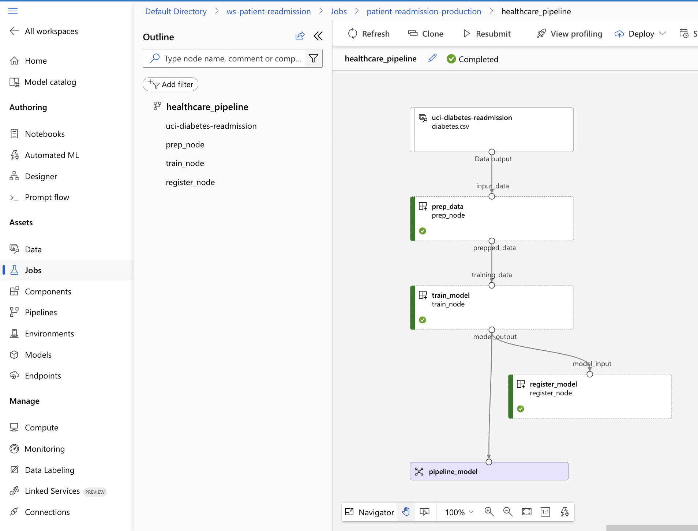
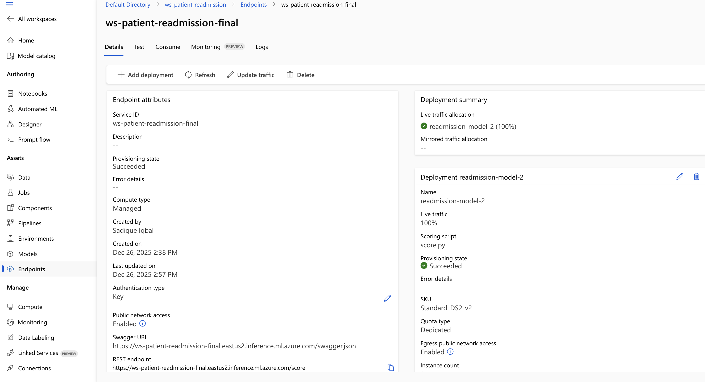
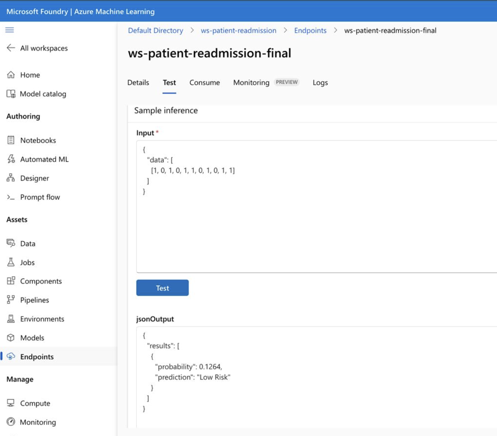

🏥 Patient Readmission Risk Prediction (Azure MLOps)

    This project delivers a production-grade, end-to-end MLOps workflow on Microsoft Azure Machine Learning to predict 30-day hospital readmission risk.
    Using the UCI Diabetes 130-US Hospitals dataset, I built and deployed a cloud-native ML system that transitions from local development to a scalable Managed Online Endpoint, serving real-time predictions via a REST API.
    The solution demonstrates hands-on experience with Azure ML, containerized inference, reproducible environments, and deployment-level debugging, reflecting real-world enterprise MLOps practices.

The Journey: From Failure to SUCCESS

    A key part of this project was the transition from local testing to a robust cloud deployment.

    Initial Challenge (The "Exit Code 3" Error): During the first deployment attempt, 
    the Azure ML inference server failed to boot because it defaulted to searching for a file named main.py.
    
    The Fix: I moved to a manual deployment strategy using a deployment.yml configuration file. 
    This allowed me to explicitly map score.py as the entry script, overriding the default and resolving the FileNotFoundError.

    Environment Syncing: I utilized a conda.yml file to ensure the cloud container (Docker) had the exact versions of 
    scikit-learn, pandas, and numpy used during local training.

Official Dataset Source

    Dataset Name:
      Diabetes 130-US Hospitals for Years 1999–2008

    Source:
     UCI Machine Learning Repository
     🔗 https://archive.ics.uci.edu/dataset/296/diabetes+130-us+hospitals+for+years+1999-2008

    Description:
       101,000+ clinical encounters
       130 U.S. hospitals
       10 years of patient data (1999–2008)
    
    Prediction Target:
    Readmitted — a categorical outcome indicating whether a patient was:
        Readmitted within 30 days
        Readmitted after 30 days
        Not readmitted

🛠️ Tech Stack & Tools

    1. Machine Learning: Python, Scikit-learn (Gradient Boosting Classifier).
    2. Cloud Platform: Azure Machine Learning (SDK v2).
    3. Deployment: Managed Online Endpoints, Docker.
    4. IDE: VS Code with Azure ML Extension.

### 📊 Project Proof of Work

#### End-to-End Training Pipeline
This pipeline illustrates the automated workflow from data ingestion to model evaluation within Azure Machine Learning.

#### Model Deployment & Performance

#### Live Inference Verification (Real-Time API)
To verify the deployment, I tested the endpoint with multiple patient profiles to ensure the model correctly distinguishes between risk levels.

**Test Case 1: Low-Risk Verification**

**Test Case 2: High-Risk Identification**

